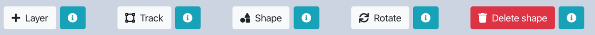
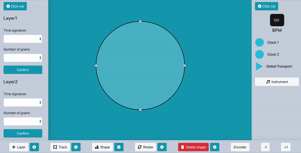
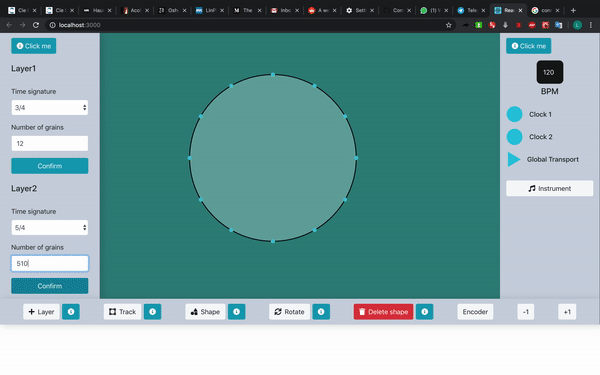
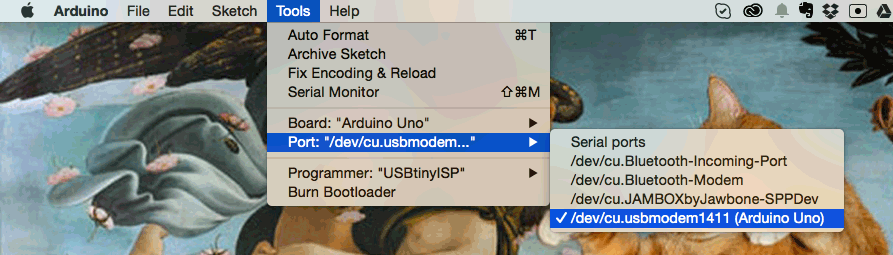
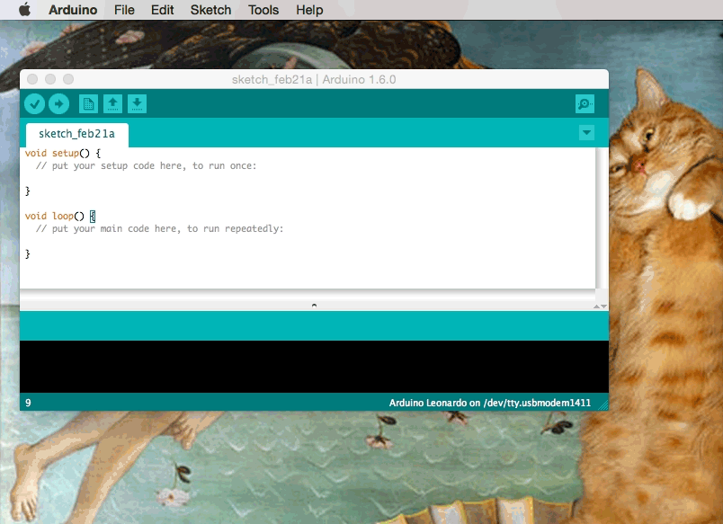
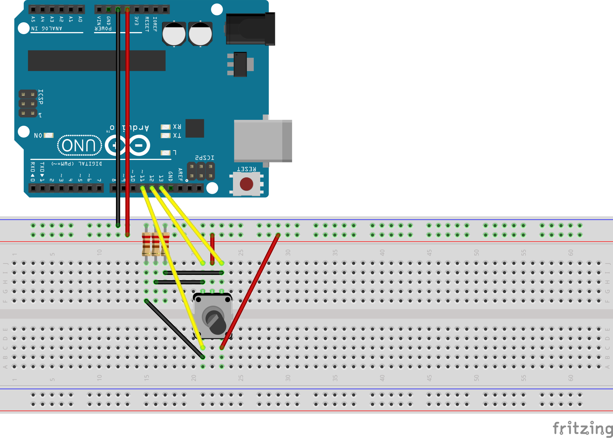

# PolyKnob

*Polyknob* is an interface that helps the user to easily create and visualize polyrhythms and more complex rhythmic structures as polymeters using as a unique tool geometrical shapes.

Check it out here http://polyknob.surge.sh/

### The Control Panel

*Pushing* a button means enter that mode
*Holding* a button means add that feature

* *TrackButton* & *ShapeButton* - Each Track can accomplish a shape
* *LayerButton* - To be added to create polymeters
* *-1* & *+1* - To move inside each mode as with the Encoder (the Knob)

## Create Polyrythms

Polyrhythms indicate the simultaneous use of two or more conflicting rhythms, that are not readily perceived as deriving from one another, or as simple manifestations of the same meter.

Definition of Kramer (UCB): 
“Polyrhythm is the simultaneous existence of different rhythmic groups in different voices”

Cross-Rhythm is a specific form of a polyrhythm. It refers to when the rhythmic conflict found in polyrhythms is the basis of an entire musical piece.

## Creating Polymeters

Rhythm in music is characterized by a repeating sequence of stressed and unstressed beats (strong vs. weak; upbeat vs. downbeat) and divided into bars organized by time signature and tempo indications. In music, time signature always occurs at start of a paper sheet, it represents the rhythm of the piece.

Polymeters are rhythms with different time signatures played in step with each other.

## App Modes

At first, the user can choose between two different modes:

In *LEARN MODE* the user is led into the creation of regular polyrhythms and polymeters with restrictions thought for learning reasons.
* Just some time-signatures considered musically important are took into account
* Just some number of grains are allowed for each time signatures
* Just regular shapes are allowed into the circle

In *PLAY MODE* the user can freely create different musical constructions.
* The user can choose whatever number of grains he wants

## Hardware

First of all we need to install the packages that are needed for the communication:

### `npm install express --save` 

### `npm install  socket.io socket.io-client --save` 

### `npm install  johnny-five --save` 

En Encoder is already working, helping you to be faster in the creation/rotation/change of sample mode.
Also a complete box will be available which will be a physical rapresentation of the ControlButtons Panel

### Setting up Arduino

Firmata is a protocol for communicating with microcontrollers from software on a computer (or smartphone/tablet, etc). The protocol can be implemented in firmware on any microcontroller architecture as well as software on any computer software package (see list of client libraries below).

Firmata is based on the midi message format in that commands bytes are 8 bits and data bytes are 7 bits. For example the midi Channel Pressure (Command: 0xD0) message is 2 bytes long, in Firmata the Command 0xD0 is used to enable reporting for a digital port (collection of 8 pins). Both the midi and Firmata versions are 2 bytes long, but the meaning is obviously different. In Firmata, the number of bytes in a message must conform with the corresponding midi message. Midi System Exclusive (Sysex) messages however, can be any length and are therefore used most prominently throughout the Firmata protocol.

Start with setting up our Arduino:

Hardware and software you need:

* Arduino (Genuino) Uno
* Arduino IDE
* Node.js

First connect your Arduino Uno to your computer with a USB cable. Meanwhile, download the Arduino IDE and install it on your computer. You will need the IDE only for the initial setup.

On Arduino IDE, go to Tools > Port and make sure the right board, Arduino Uno, is connected to the right port (tty.usbmodem… for Mac, cu.usbmodem…for Windows).

Johnny-Five communicates with Arduino using the Firmata protocol, so you need to install StandardFirmata:

* On IDE, open File > Examples > Firmata > StandardFirmata.
* Click the upload button (arrow button).
* Wait until the IDE message window says “Done uploading”.
* Close the IDE. You don’t need the IDE anymore unless you want to keep using it for coding.

### Setting up Encoder

A simple encoder or simply an encoder in digital electronics is a one-hot to binary converter. That is, if there are 2n input lines, and at most only one of them will ever be high, the binary code of this 'hot' line is produced on the n-bit output lines.

### Make everything work

With the code above the communication is now set through socket in your local host.
In order to serve the Arduino (encoder) download the repository, set up the communication running  `node server.js` then start the application through  `npm run start`
Remember that, even if your running the deployed version (on surge) you need anyway to run the server.js though node.
Every command related to *+1* and *-1* are driven by the encoder. Rotate, change shape and instrument, switch between layers and create your patterns!
By pressing the Encoder (on the top as a button) you will be also able to set a trig when defining a custom shape in the shape mode.

## The audio Engine

Lets now install the tone library. Just type this in your terminal app of choice.
### `npm install  — save tone` 
Great. That’s all installation for tone.

Our TS lint is very rigid and doesn’t like modules that don’t have types, which sadly is the case of the Tone lib. In order to be able to use tone without our lint freaking out we’ll have to disable `noImplicitAny`
For that go to the tsconfig.json and change
`“noImplicitAny”: true,` to `“noImplicitAny”: false,`(if it's not there just add it!)
I would recommend doing the same for `noUnusedLocals` as I think it is a bit unnecessary. But feel free to choose.

## Getting Started

These instructions will get you a copy of the project up and running on your local machine for development and testing purposes. See deployment for notes on how to deploy the project on a live system.

This project was bootstrapped with [Create React App](https://github.com/facebook/create-react-app).

## Available Scripts

In the project directory, you can run:

### `npm start`

Runs the app in the development mode. 
Open [http://localhost:3000](http://localhost:3000) to view it in the browser.

The page will reload if you make edits. 
You will also see any lint errors in the console.

### `npm test`

Launches the test runner in the interactive watch mode. 
See the section about [running tests](https://facebook.github.io/create-react-app/docs/running-tests) for more information.

### `npm run build`

Builds the app for production to the `build` folder. 
It correctly bundles React in production mode and optimizes the build for the best performance.

The build is minified and the filenames include the hashes. 
Your app is ready to be deployed!

See the section about [deployment](https://facebook.github.io/create-react-app/docs/deployment) for more information.

### `npm run eject`

**Note: this is a one-way operation. Once you `eject`, you can’t go back!**

If you aren’t satisfied with the build tool and configuration choices, you can `eject` at any time. This command will remove the single build dependency from your project.

Instead, it will copy all the configuration files and the transitive dependencies (Webpack, Babel, ESLint, etc) right into your project so you have full control over them. All of the commands except `eject` will still work, but they will point to the copied scripts so you can tweak them. At this point you’re on your own.

You don’t have to ever use `eject`. The curated feature set is suitable for small and middle deployments, and you shouldn’t feel obligated to use this feature. However we understand that this tool wouldn’t be useful if you couldn’t customize it when you are ready for it.

## Learn More

You can learn more in the [Create React App documentation](https://facebook.github.io/create-react-app/docs/getting-started).

To learn React, check out the [React documentation](https://reactjs.org/).
